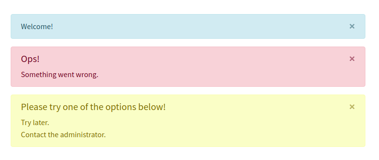

# Bootstrap 3 alerts for laravel 5.*
[](https://packagist.org/packages/tjgazel/laravel-bs3-alert)
[](https://github.com/tjgazel/laravel-bs3-alert/blob/master/LICENSE)
[](https://packagist.org/packages/tjgazel/laravel-bs3-alert)



<br>

- [Instalation](#instalation)
- [Usage](#usage)
- [Tanks](#tanks)

**Other packages:**
- [tjgazel/laravel-toastr](https://github.com/tjgazel/laravel-toastr) - Toastr notifications for laravel 5.* <br>
- [tjgazel/laravel-bs4-alert](https://github.com/tjgazel/laravel-bs4-alert) - Bootstrap 4 alerts for laravel 5.*

<br>

<a name="instalation"></a>
## Installation

**1)** Run `composer require tjgazel/laravel-bs3-alert` to include this in your project.<br>
`Laravel 5.5 or later` will automatically discover the provider and the alias.

<br>

**2)** *Optional:* Laravel 5.4 and below <br>
Add `TJGazel\Bs3Alert\Bs3AlertServiceProvider::class` to `providers` in `config/app.php` <br> 
Add `'Bs3Alert' => TJGazel\Bs3Alert\Facades\Bs3Alert::class` to `aliases` in `config/app.php`. <br>
```
// config/app.php
'providers' => [
  // ...
  TJGazel\Bs3Alert\Bs3AlertServiceProvider::class,
],

'aliases' => [
  // ...
  'Bs3Alert' => TJGazel\Bs3Alert\Facades\Bs3Alert::class,
],
```

<br>

**3)** Run `php artisan vendor:publish --provider="TJGazel\Bs3Alert\Bs3AlertServiceProvider" --tag="config"`
to publish the config file in `config/bs3-alert.php`. <br>

**4)** Include `@include('bs3-alert::template')` somewhere in your template..
```
<!DOCTYPE html>
<html lang="{{ app()->getLocale() }}">
<head>
    <title></title>
    <link rel="stylesheet" type="text/css" href="/css/app.css">
</head>
<body>
    <div id="app">
        <header></header>
        
        @include('bs3-alert::template')

        <main>
            @yield('content')
        </main>

        <footer></footer>
    </app>
    <script type="text/javascript" src="js/app.js"></script>
</body>
</html>
```

<br>

**5)** *Optional:* Run `php artisan vendor:publish --provider="TJGazel\Bs3Alert\Bs3AlertServiceProvider" --tag="template"`
to publish the template view. <br>
Modify the published template located at `resources/views/vendor/bs3-alert/template.php` to your liking.
```
@if(session()->has(config()->get('bs3-alert.session_name')))
  @foreach(session()->get(config()->get('bs3-alert.session_name')) as $bs3Alert)
    <div class="alert {{ $bs3Alert['type'] }} alert-dismissible" role="alert">
      <button type="button" class="close" data-dismiss="alert" aria-label="Close">
        <span aria-hidden="true">&times;</span>
      </button>
      @if($bs3Alert['title'])
        <p><strong>{!! $bs3Alert['title'] !!}</strong></p>
      @endif
      @foreach($bs3Alert['messages'] as $bs3AlertMessage)
        <p style="line-height: 1.1em">{!! $bs3AlertMessage !!}</p>
      @endforeach
    </div>
  @endforeach
@endif
```

 <br>

**6)** *Optional:* Modify the publish configuration file locate at `config/bs3-alert.php` to your liking.
```
<?php

return [
 
    'session_name' => 'bs3alert',

    // Set classname for alerts
    'class' => [
        'success'   => 'alert-success',
        'info'      => 'alert-info',
        'warning'   => 'alert-warning',
        'danger'    => 'alert-danger',
    ]

];
```
<br><br>

<a name="usage"></a>
## Usage

Use the Toastr facade `Bs3Alert::` or the helper function `bs3Alert()->` to access the methods in this package.
```
Bs3Alert::light(array $message, string $title = null);

bs3Alert()->dark(array $message, string $title = null);
```

<br>

**Examples:**
```
<?php

namespace App\Http\Controllers;

use Illuminate\Http\Request;
use TJGazel\Bs3Alert\Facades\Bs3Alert;

class HomeController extends Controller
{

    public function index()
    {
        Bs3Alert::info(['welcome!']);

        return view('dashoard.index');
    }
}
```

<br>

You can also chain multiple messages together using:
```
bs3Alert()
    ->danger(['Something went wrong.'], 'Ops!')
    ->warning(['Try later.', 'Contact the administrator.'], 'Please try one of the options below!');
```
<br><br>

**All methods** <br>
```
bs3Alert()->success();
bs3Alert()->danger();
bs3Alert()->warning();
bs3Alert()->info();
```
<br>

<a name="tanks"></a>
### Tanks for:
[Bootstrap](http://getbootstrap.com/) <br>
[Laravel](https://laravel.com/)

**Author:** Talles Gazel <br>
[Home page](https://tjgweb.com.br/) <br>
[Facebook](https://www.facebook.com/talles.gazel) <br>